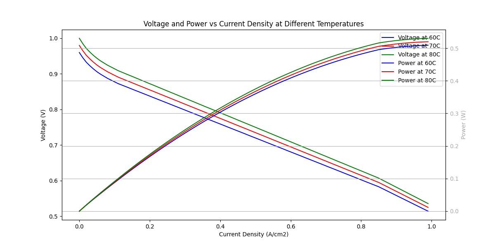
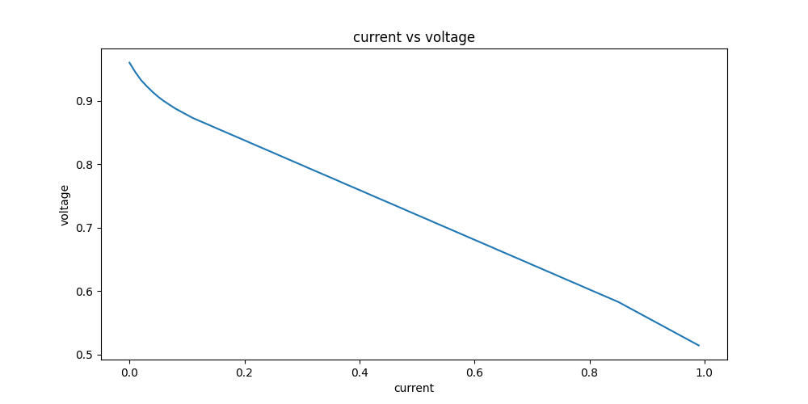
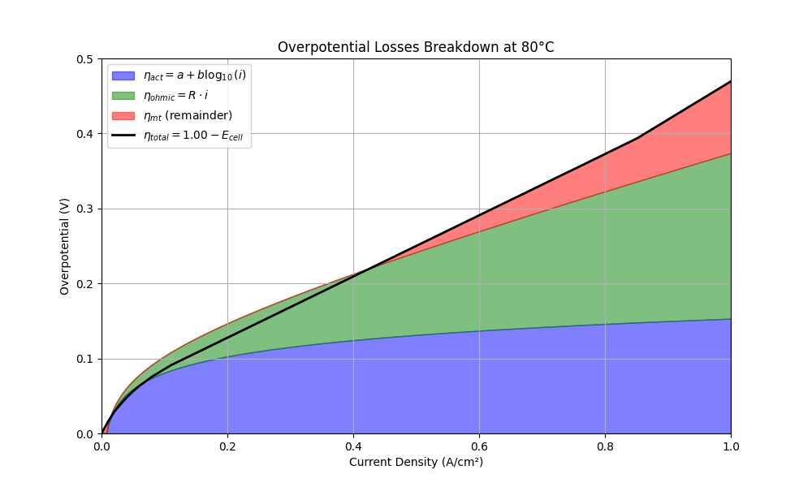

# 🔋 Fuel Cell Performance Analysis

## 👨‍🎓 Student
Subhransu Swain  

---

## 📌 Overview
This project analyzes fuel cell performance through three experiments using Python.

---

## 🔬 Experiments

### 1. Basic Analysis
- Voltage vs Current Density  
- Performance characteristics  

---

### 2. Temperature Comparison
- Combined plots for different temperatures  
- Voltage & Power vs Current Density  

---

### 3. Overpotential Losses
- Activation losses  
- Ohmic losses  
- Concentration losses  
- Effect on fuel cell efficiency  

---

## ⚙️ Tools Used
- Python  
- NumPy  
- Matplotlib  
- Google Colab  

---

## 📊 Output

### Experiment 1

### Experiment 2

### Experiment 3

---

## 📁 Structure
- notebooks/ → all experiments  
- images/ → graphs  

---
## 📌 Conclusion
Fuel cell performance depends on temperature and losses.  
Overpotential losses significantly reduce efficiency at higher current densities.

---
